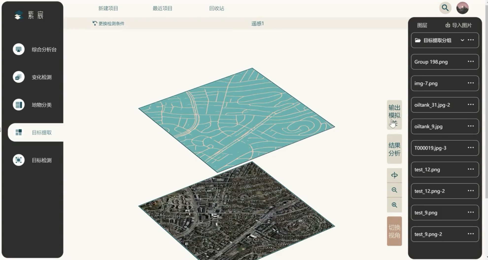

# remote-sensing

2022 中国软件杯 题目 4

## 部署方法

- `git clone` 克隆本项目
- `npm i` 或 `cnpm i` 安装依赖
- `npm run build` 得到打包目录 dist，如果遇到报错信息，定位到报错的那一行代码，在它的上一行加上`/*@ts-ignore*/`，重新打包
- 购买一台服务器，通过 sftp 将打包得到的的 /dist 上传至服务器
- 购买域名，完成域名解析
- ssh 远程连接服务器，安装 nginx，完成 nginx.conf 的配置，最终执行`/usr/local/nginx/sbin/nginx -s reload`
- 访问域名，即可看到网站，部署成功

## 项目介绍

遥感平台[紫宸](https://github.com/DanmoSAMA/remote-sensing)：参与中国软件杯并获得国家三等奖。该平台共提供变化监测、地物分类、目标提取、目标检测和综合检测五种功能。其中综合检测（未完全实现）是对其他四种的综合，先对同一张图进行多种检测，再进行综合检测，会把这些图片按照一定的次序显示出来，便于用户查看和对比不同的检测结果。

该项目曾经部署于阿里云服务器，目前已经下线，故采用图片方式进行演示：

用户首先进行登陆注册，然后可以新建项目，同时用户可以在“最近项目”中查看最近的八个项目，被删除的项目会移入回收站，在回收站中可以真正删除一个项目。

在项目中上传图片，然后选择图片进行分析，分析后提供轴侧和平面两种视角。

如图所示为轴侧视角，变化监测需要提供同一地区的新、老两张图片，进行分析后，可以打开输出模拟，这样检测的结果（最上方）可以投影到其他图片上，从而直观地看出变化。同时可以选择打开结果分析（右侧），查看不同元素的比例。该视角中海可以放大缩小、以及绕轴旋转。每一个图层都可以单击放大，如图所示：

点击“切换视角”可以切换到平面视角，该视角主要的特色是，中间存在一个可以拖动的轴（使用 MUI 的进度条实现），通过对轴的拖动直观地感受变化。并且注意到右侧每一组图片都显示为一个目录——刚刚完成上传的图片都是单独的，在完成某种分析后会形成目录，图片和目录都可以更名或删除，目录中的图片同理。

再稍加演示其他类型的分析，目标提取就是提取出某些物体（如道路）的轮廓，对于前端而言，没有新的技术点。

最后值得指出的是目标检测，需要选择检测那一类物体，在图上进行标注。

综合分析顾名思义，就是前面所有分析的综合。

- 使用 mui + React 进行组件化开发。

- 使用 canvas 来完成目标检测的绘图。

- 使用 formData 完成图片的上传，支持一次上传多张图片，此时将请求加入 promise 数组，用 promise.all 方法进行优化。

- 使用 perspective 和 preserve-3d 属性来实现立体效果，从而完成轴侧视角。
